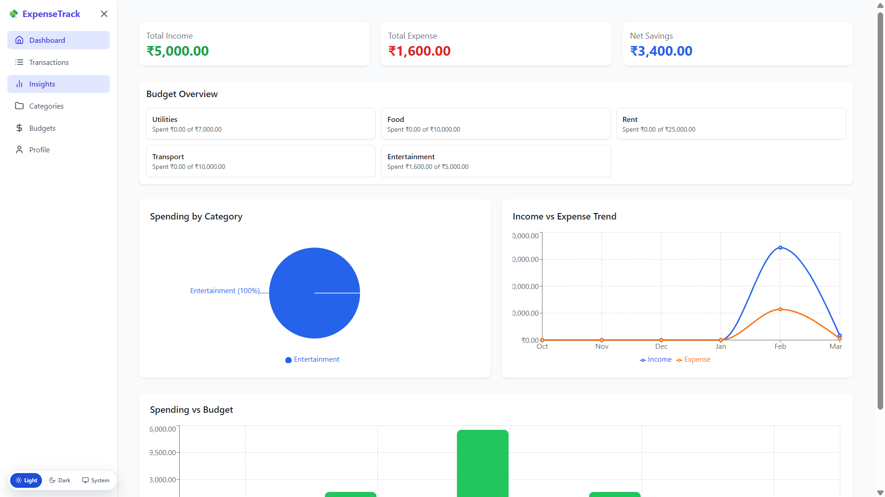
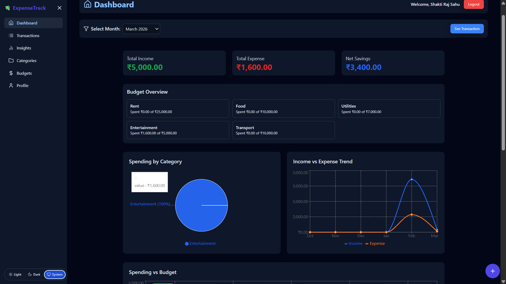
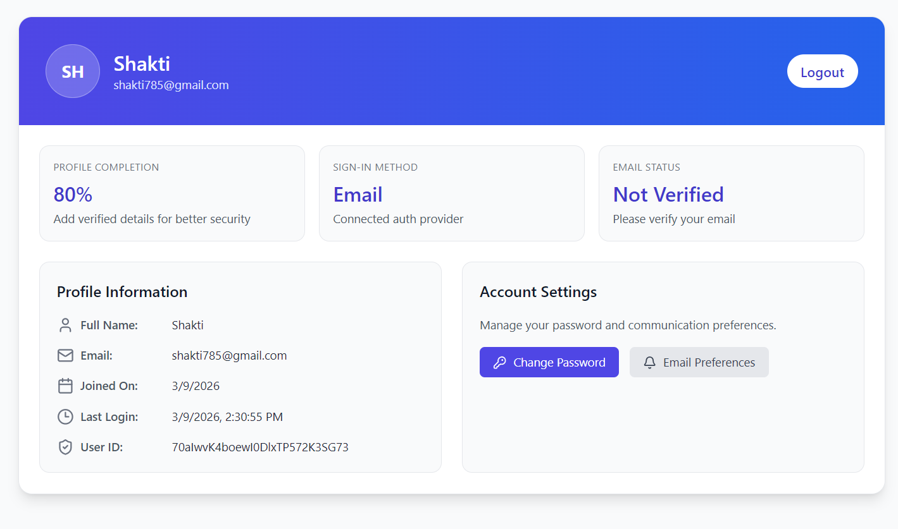
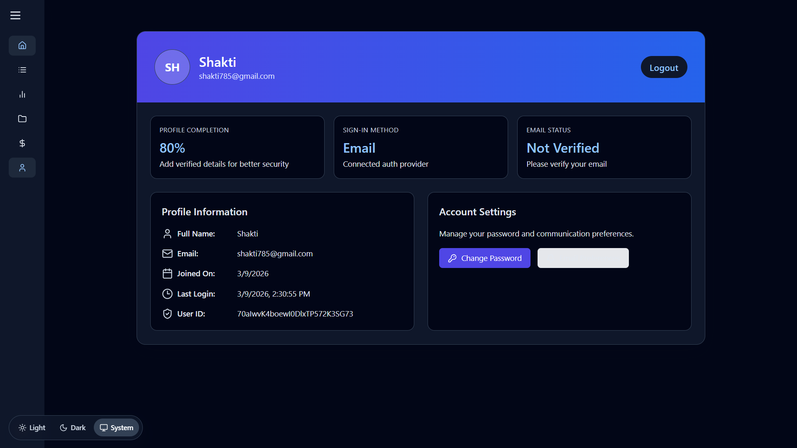

# Expense Tracker


Track income, expenses, budgets, insights, and shared bills in one React + Firebase app. The project now includes a roommate split flow that works in two modes:

- Signed-in mode with Firebase persistence
- Guest mode with local browser storage

Roommates do not need their own account to be added to a split.

## Highlights

- Email/password and Google authentication
- Transaction dashboard with filters and quick-add flows
- Category and monthly budget management
- Insights and visual spending summaries
- Profile and account utilities
- Roommate bill splitting with equal/custom shares
- Guest-friendly roommate splitting with local persistence
- Responsive UI built with Tailwind CSS

## Demo Media

### Screenshots

| Screen | Preview |
| --- | --- |
| Dashboard |  |
| Dashboard Dark |  |
| Profile |  |
| Profile Dark |  |

### Video Walkthroughs

- [Dashboard demo](public/demo/dashboard-view.mp4)
- [Budget demo](public/demo/budgetview.mp4)
- [Category demo](public/demo/categoryview.mp4)
- [Transaction demo](public/demo/transactionview.mp4)

## Core Features

### Personal finance

- Add income and expense transactions
- Track monthly cash flow
- Organize entries by category
- Manage monthly budgets
- Review spending insights

### Shared expense workflow

- Add roommates, friends, or flatmates without requiring them to register
- Create splits from existing expense entries
- Add a quick expense directly inside the split page
- Split equally or assign custom amounts
- Mark shares as settled
- Copy reminder text for pending balances

## Routes

- `/` landing page
- `/login` login
- `/register` register
- `/roommate-splits` public roommate split workspace
- `/dashboard` dashboard overview
- `/dashboard/transactions` transactions
- `/dashboard/categories` categories
- `/dashboard/budgets` budgets
- `/dashboard/insights` insights
- `/dashboard/profile` profile

## Tech Stack

| Layer | Tech |
| --- | --- |
| Frontend | React 19, React Router, Tailwind CSS |
| Backend | Firebase Authentication, Firestore |
| Charts | Recharts, Chart.js |
| Tooling | Vite, ESLint, Prettier |

## Getting Started

```bash
git clone https://github.com/DEVS-shakti/expense-tracker.git
cd expense-tracker
npm install
npm run dev
```

The app runs on `http://localhost:5173`.

## Environment Variables

Create a `.env` file based on `.env.example` and add:

```env
VITE_FIREBASE_API_KEY=
VITE_FIREBASE_AUTH_DOMAIN=
VITE_FIREBASE_PROJECT_ID=
VITE_FIREBASE_STORAGE_BUCKET=
VITE_FIREBASE_MESSAGING_SENDER_ID=
VITE_FIREBASE_APP_ID=
VITE_FIREBASE_MEASUREMENT_ID=
```

## Firebase Notes

- Enable Email/Password auth
- Enable Google auth if you want Google sign-in
- Enable Firestore
- Add your local/dev domain to authorized domains

## Scripts

- `npm run dev` start local development server
- `npm run build` create production build
- `npm run preview` preview the production build
- `npm run lint` run ESLint

## Project Structure

```text
src/
  components/
  context/
  data/
  firebase/
  layouts/
  pages/
  routes/
  services/
  utils/
public/
  demo/
README.md
```

## Recent Update

- Updated the roommate split page UI/UX
- Removed the account requirement for using roommate splits
- Added guest-mode local storage support for shared expenses
- Rewrote the README to include real project media and current features

## License

MIT. See [LICENSE](LICENSE).
